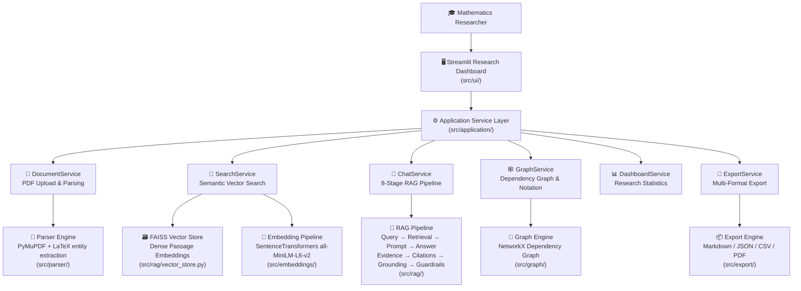

# MathResearch Studio

> **AI-Powered Mathematical Research Workspace** — Upload, Explore, Search, and Query your mathematics literature with the power of semantic AI.

[](https://www.python.org/)
[](https://streamlit.io/)
[](./LICENSE)
[](#running-tests)
[](./CHANGELOG.md)

---

## Project Overview

**MathResearch Studio** is an interactive AI-powered research workspace built specifically for mathematicians and mathematics researchers. It transforms dense academic PDF papers into a structured, searchable, and query-ready knowledge environment — all powered by semantic embeddings, dependency graphs, and a grounded Retrieval-Augmented Generation (RAG) AI assistant.

Version 1.0 delivers a complete end-to-end research workflow: from uploading PDF research papers to asking precise mathematical questions grounded strictly in the uploaded literature.

---

## Motivation

Mathematics researchers spend significant time:

- Reading and cross-referencing dense academic papers.
- Tracing definition and theorem dependencies across works.
- Organizing mathematical notation across multiple authors and papers.
- Building structured notes for surveys, thesis chapters, and grant reports.

Existing tools focus on symbolic computation and theorem proving but leave the **literature understanding and knowledge organization workflow** largely underserved.

**MathResearch Studio** addresses this gap by acting as an intelligent research assistant — not by replacing mathematical reasoning, but by making it far easier to navigate, organize, and query a personal mathematics paper library.

---

## Problem Statement

Researchers need a system that:

- Converts uploaded PDF papers into structured, searchable knowledge.
- Extracts mathematical entities (definitions, theorems, lemmas, proofs) automatically.
- Allows natural language search across uploaded paper collections.
- Answers research questions grounded **only** in uploaded sources (no hallucinations).
- Visualizes theorem-to-proof dependency chains as interactive graphs.
- Organizes mathematical notation and symbols into a searchable dictionary.
- Exports organized research notes in multiple formats for writing workflows.

---

## Why MathResearch Studio?

| Feature | MathResearch Studio | Generic PDF Tools | CAS / Theorem Provers |
|---|---|---|---|
| Mathematical entity extraction | ✅ | ❌ | Partial |
| Grounded AI answers (no hallucination) | ✅ | ❌ | ❌ |
| Theorem dependency graph | ✅ | ❌ | Partial |
| Notation dictionary | ✅ | ❌ | ❌ |
| Semantic search across papers | ✅ | ❌ | ❌ |
| Research export (Markdown, JSON, CSV, PDF) | ✅ | Partial | ❌ |
| Designed for non-technical mathematicians | ✅ | ❌ | ❌ |

---

## Key Features

### 📄 PDF Upload & Document Library
Upload one or more mathematics research papers in PDF format. The system automatically parses text, extracts structural sections, and catalogs papers with metadata.

### 🔍 Mathematical Entity Extraction
Automatically extracts formal mathematical structures from paper content:
- **Definition extraction** — formal definitions with section and page references
- **Theorem extraction** — theorem statements and their conditions
- **Lemma extraction** — auxiliary mathematical lemmas
- **Proof extraction** — formal proof text linked to parent theorems

### 🕸️ Theorem Dependency Graph
Builds an interactive directed graph of mathematical statement dependencies — showing which theorems depend on which lemmas, definitions, and corollaries. Visualize proof chains across your entire paper library.

### 📖 Notation Dictionary
Automatically constructs a mathematical notation dictionary from all uploaded papers. Search and browse symbols, variables, operators, sets, and matrices organized by category.

### 🔎 Semantic Paper Search
Ask natural language questions or enter search terms to find the most relevant passages across your entire uploaded paper library. Powered by dense 384-dimensional sentence embeddings and FAISS vector similarity search.

### 💬 AI Research Assistant
Ask research questions and receive structured, evidence-backed answers grounded **exclusively** in your uploaded papers. The 8-stage RAG pipeline ensures:
- Answers are traceable to source passages
- Citations link directly to paper, section, and page
- Grounding score measures how well the answer is supported by evidence
- Guardrails prevent speculation beyond uploaded content

### 📊 Research Statistics Dashboard
View system-wide research metrics: total papers cataloged, mathematical entities extracted, vector passages indexed, graph nodes and edges, and publication year distributions.

### 💾 Export Center
Export your organized research materials in multiple formats:
- **Markdown** — readable notes for writing workflows
- **JSON** — structured data for downstream tools
- **CSV** — spreadsheet-compatible paper metadata
- **PDF** — printable research summaries

---

## System Architecture



---

## Technology Stack

| Category | Technology | Purpose |
|---|---|---|
| **Language** | Python 3.12 | Core application runtime |
| **UI Framework** | Streamlit | Interactive researcher dashboard |
| **API Layer** | FastAPI | Backend service endpoints |
| **PDF Parsing** | PyMuPDF (fitz) | PDF text and layout extraction |
| **Embeddings** | SentenceTransformers (`all-MiniLM-L6-v2`) | 384-d dense passage vectorization |
| **Vector Search** | FAISS (`IndexFlatIP`) | Cosine similarity passage retrieval |
| **Graph Engine** | NetworkX | Directed dependency graph construction |
| **Graph Viz** | PyVis | Interactive HTML graph rendering |
| **AI / LLM** | Mock LLM (pluggable adapter for OpenAI/Ollama) | Grounded research question answering |
| **RAG Pipeline** | Custom 8-stage pipeline | Query → Answer with evidence and citations |
| **Testing** | pytest | 225 unit & integration tests |
| **Version Control** | Git / GitHub | Source control and collaboration |

---

## Installation

### Prerequisites

- Python **3.11+** (Python 3.12 recommended)
- Git

### Step-by-Step Setup

**1. Clone the repository**
```bash
git clone https://github.com/Anamikamahi18/MathResearch_Studio.git
cd MathResearch_Studio
```

**2. Create and activate a virtual environment**
```bash
# Windows
python -m venv venv
venv\Scripts\activate

# macOS / Linux
python3 -m venv venv
source venv/bin/activate
```

**3. Install dependencies**
```bash
pip install -r requirements.txt
```

**4. Verify installation**
```bash
python -m pytest --tb=short -q
```

All **225 tests** should pass.

---

## Configuration

Create a `.env` file in the project root for optional configuration:

```env
# Hugging Face Hub token (optional — increases model download rate limits)
HF_TOKEN=hf_xxxxxxxxxxxxxxxxxxxxxxxxxxxxxxxx

# LLM Provider: "mock" (default offline) | "openai" | "ollama"
LLM_PROVIDER=mock

# Export output directory
EXPORT_DIR=exports

# Upload directory
UPLOAD_DIR=uploads
```

> **Note**: The application runs fully offline with the default `mock` LLM adapter. No API keys are required for local development.

---

## Running the Application

### Launch the Research Dashboard

```bash
streamlit run src/ui/app.py
```

Open your browser at **http://localhost:8501**

### Run the PDF Parsing Pipeline (CLI)

```bash
python -m src.parser.pipeline tests/sample_papers --output-dir exports/parser_outputs
```

### Run End-to-End System Verification

```bash
python scripts/verify_end_to_end.py
```

### Run Performance Benchmark

```bash
python scripts/benchmark_performance.py
```

---

## Running Tests

```bash
# Full regression suite (225 tests)
python -m pytest

# Specific test module
python -m pytest tests/test_ai_assistant.py -v

# With coverage report
python -m pytest --cov=src --cov-report=term-missing
```

---

## Project Structure

```
MathResearchStudio/
├── src/
│   ├── application/          # Application service layer
│   │   ├── document_service.py   # PDF upload, parse, catalog
│   │   ├── search_service.py     # Semantic search
│   │   ├── chat_service.py       # RAG AI assistant
│   │   ├── graph_service.py      # Dependency graph & notation
│   │   ├── dashboard_service.py  # Research statistics
│   │   └── export_service.py     # Multi-format export
│   ├── parser/               # PDF parsing & entity extraction
│   ├── embeddings/           # Sentence embedding pipeline
│   ├── rag/                  # RAG pipeline (8 stages)
│   │   ├── query_processing/     # Query normalization & intent
│   │   ├── retrieval/            # Hybrid FAISS + keyword retrieval
│   │   ├── prompt_builder/       # Token-budgeted prompt builder
│   │   ├── llm/                  # Pluggable LLM adapter layer
│   │   ├── answer_generator/     # Structured answer generation
│   │   ├── evidence/             # Sentence-level evidence mapping
│   │   ├── citation_engine/      # Academic citation formatter
│   │   ├── grounding/            # Grounding verification & scoring
│   │   ├── guardrails/           # Response policy guardrails
│   │   └── vector_store.py       # FAISS vector index
│   ├── graph/                # Dependency graph & notation engine
│   ├── export/               # Export engine (MD, JSON, CSV, PDF)
│   └── ui/                   # Streamlit dashboard
│       ├── app.py                # Application entrypoint
│       ├── router.py             # Page router
│       ├── layout.py             # App shell layout
│       └── pages/                # 10 interactive research pages
├── tests/                    # 225 pytest unit & integration tests
├── scripts/                  # CLI utility scripts
│   ├── verify_end_to_end.py      # Full system verification
│   └── benchmark_performance.py  # Performance benchmarking
├── docs/                     # Technical documentation
├── reports/                  # Day-by-day progress reports
├── exports/                  # Generated export files & vector store
├── architecture/             # System architecture diagrams
├── requirements.txt          # Python dependencies
├── CHANGELOG.md              # Version history
├── CONTRIBUTING.md           # Contribution guidelines
├── CODE_OF_CONDUCT.md        # Community code of conduct
├── SECURITY.md               # Security policy
└── LICENSE                   # MIT License
```

---

## Example Research Workflow

1. **Open the dashboard** — `streamlit run src/ui/app.py`
2. **Upload PDFs** — Drag and drop your mathematics research papers in the **Upload Papers** page.
3. **Browse the library** — View extracted definitions, theorems, lemmas, and proofs in the **Document Library** page.
4. **Search your literature** — Enter natural language queries in the **Semantic Search** page to find relevant passages.
5. **Ask the AI Assistant** — Ask precise research questions in the **AI Research Assistant** page and receive grounded, cited answers.
6. **Explore the proof graph** — Visualize theorem dependency chains in the **Proof Dependency Graph** page.
7. **Browse notation** — Look up symbols and mathematical notation in the **Notation Dictionary** page.
8. **Check statistics** — View a research progress overview in the **Research Overview** page.
9. **Export your notes** — Download organized research materials in Markdown, JSON, CSV, or PDF from the **Export Center** page.

---

## Screenshots

> *Screenshots and workflow demonstrations will be added in a future release.*

---

## Demo Video

> *A full walkthrough video demonstrating all key features will be linked here in a future release.*

---

## Roadmap

### ✅ Version 1.0.0 (Current Release)
- PDF upload and ingestion
- Mathematical entity extraction (definitions, theorems, lemmas, proofs)
- Dense semantic search (FAISS + SentenceTransformers)
- 8-stage grounded RAG AI assistant
- Theorem proof dependency graph (NetworkX + PyVis)
- Notation dictionary
- Research statistics dashboard
- Multi-format export center (Markdown, JSON, CSV, PDF)
- 225 automated tests (100% pass rate)

### 🔭 Version 2.0 (Planned)
- GPU-accelerated ONNX embedding inference (10x faster)
- Real-time LLM integration (OpenAI GPT-4o, Ollama Llama 3, Anthropic Claude)
- Cloud vector database adapter (Pinecone / Milvus)
- Interactive 3D dependency graph visualization (WebGL)
- Multi-paper cross-reference relationship analysis
- Annotation and collaborative research notes
- arXiv and Semantic Scholar paper import integrations
- Mobile-responsive interface

### 🌐 Long-Term Vision
Building MathResearch Studio into a comprehensive AI-powered mathematics research platform used by MSc students, PhD scholars, university research groups, and mathematical institutes worldwide.

---

## Contributing

Contributions are welcome! Please see [CONTRIBUTING.md](./CONTRIBUTING.md) for detailed guidelines.

**Quick Start:**
1. Fork the repository.
2. Create a feature branch: `git checkout -b feature/my-improvement`
3. Make focused, well-documented changes.
4. Run the full test suite: `python -m pytest`
5. Open a pull request with a clear description.

---

## License

This project is licensed under the **MIT License**. See the [LICENSE](./LICENSE) file for full details.

---

## Acknowledgements

- **SentenceTransformers** — Hugging Face `all-MiniLM-L6-v2` model for fast, high-quality sentence embeddings.
- **FAISS** — Facebook AI Research for efficient similarity search.
- **PyMuPDF** — Artifex Software for reliable PDF text extraction.
- **NetworkX** — Graph analysis library for theorem dependency modeling.
- **PyVis** — Interactive network visualization library.
- **Streamlit** — The framework powering the interactive researcher dashboard.
- Inspired by the research needs of mathematics scholars and graduate students.
