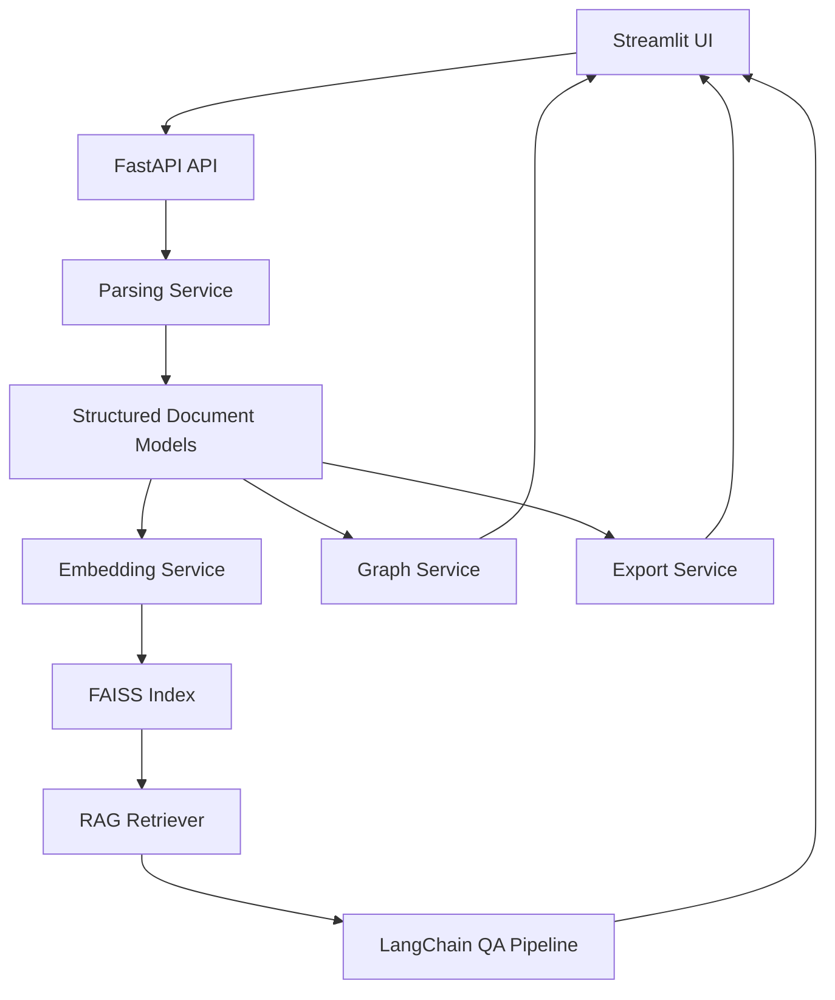

# Project Architecture

## Overview

MathResearch Studio v1 should be designed as a modular Python system that assists mathematical researchers throughout a literature workflow without attempting to automate mathematical reasoning. The architecture should support PDF ingestion, structured extraction, semantic retrieval, grounded question answering, dependency graph generation, and research note export.

The system is built around four core technologies:

- Streamlit for the interactive research workspace UI
- FastAPI for backend APIs and service orchestration
- LangChain for retrieval and question answering pipelines
- FAISS for vector storage and semantic search

The design should keep parsing, retrieval, graph analysis, UI, and utilities as independent modules with narrow responsibilities.

## Architectural Principles

### SOLID Alignment

- **Single Responsibility Principle**: Each module should do one job well, such as parsing PDFs, generating embeddings, or rendering the dashboard.
- **Open/Closed Principle**: New parsers, embedding providers, or vector stores should be addable with minimal modification to existing code.
- **Liskov Substitution Principle**: Interfaces for parsers, retrievers, and exporters should allow interchangeable implementations.
- **Interface Segregation Principle**: Components should depend only on small, focused interfaces rather than large shared abstractions.
- **Dependency Inversion Principle**: High-level workflows should depend on abstractions, not concrete libraries such as FAISS or a specific LLM vendor.

### Additional Design Goals

- Clear separation between UI, API, domain logic, and infrastructure
- Testable services with minimal framework coupling
- Replaceable storage and model components
- Simple local development path for Version 1
- Extensible pipeline for future Version 2 features

## High-Level Workflow

1. A user uploads one or more PDF research papers through the Streamlit interface.
2. FastAPI receives the file metadata and coordinates the ingestion workflow.
3. The parser module extracts raw text, metadata, and candidate structural sections.
4. Extracted content is normalized into internal document models.
5. The embeddings module generates vector representations for searchable chunks.
6. The RAG module indexes content into FAISS and supports semantic retrieval.
7. The graph module builds dependency relationships between definitions, lemmas, theorems, and proofs.
8. The UI presents search, question answering, dependency views, and export options.
9. The export module generates structured notes for downstream use.

## Proposed Module Structure

```text
src/
├── parser/
├── rag/
├── embeddings/
├── graph/
├── ui/
├── export/
└── utils/
```

## Module Responsibilities

### parser/

Responsible for document ingestion and structural extraction.

**Responsibilities**
- Read uploaded PDF files
- Extract text and basic metadata
- Split papers into logical sections
- Detect candidate definitions, theorems, lemmas, and proofs
- Normalize extracted outputs into domain objects

**Suggested components**
- `pdf_loader.py`
- `text_extractor.py`
- `section_detector.py`
- `math_entity_extractor.py`
- `document_models.py`

**Example abstractions**
- `DocumentParser`
- `SectionDetector`
- `MathStatementExtractor`

### embeddings/

Responsible for chunk preparation and vector generation.

**Responsibilities**
- Chunk extracted text for retrieval
- Generate embeddings using a configurable provider
- Store embedding metadata for traceability

**Suggested components**
- `chunker.py`
- `embedding_service.py`
- `embedding_models.py`

**Example abstractions**
- `TextChunker`
- `EmbeddingProvider`

### rag/

Responsible for indexing, retrieval, and grounded question answering.

**Responsibilities**
- Build and update the FAISS vector index
- Retrieve relevant chunks for a user query
- Assemble LangChain retrieval pipelines
- Enforce source-grounded answers based only on uploaded papers

**Suggested components**
- `vector_store.py`
- `retriever.py`
- `qa_chain.py`
- `citation_formatter.py`

**Example abstractions**
- `VectorIndex`
- `DocumentRetriever`
- `QuestionAnsweringService`

### graph/

Responsible for mathematical dependency analysis.

**Responsibilities**
- Represent relationships between definitions, lemmas, theorems, and proofs
- Build dependency graphs from extracted entities
- Support graph queries for exploration
- Prepare graph data for UI visualization

**Suggested components**
- `graph_builder.py`
- `dependency_resolver.py`
- `graph_models.py`
- `graph_service.py`

**Example abstractions**
- `DependencyGraphBuilder`
- `GraphRepository`

### ui/

Responsible for the user-facing research workspace in Streamlit.

**Responsibilities**
- Upload PDFs
- Display extraction results
- Provide search and Q&A interactions
- Show dependency graph summaries
- Trigger note export workflows

**Suggested components**
- `app.py`
- `pages/upload.py`
- `pages/search.py`
- `pages/assistant.py`
- `pages/graph_view.py`
- `pages/export.py`
- `state.py`

### export/

Responsible for producing structured outputs.

**Responsibilities**
- Export extracted content and summaries
- Generate markdown research notes
- Package outputs for local download

**Suggested components**
- `note_exporter.py`
- `markdown_formatter.py`
- `export_service.py`

**Example abstractions**
- `ResearchNoteExporter`

### utils/

Responsible for shared helpers that do not belong to a single domain module.

**Responsibilities**
- Logging
- Configuration loading
- File handling helpers
- Common schemas and validation helpers
- Error formatting

**Suggested components**
- `config.py`
- `logging_utils.py`
- `file_utils.py`
- `exceptions.py`

## Application Layers

### 1. Presentation Layer

This layer contains the Streamlit application and user interaction logic.

- Collects user input
- Displays outputs and status
- Calls backend APIs instead of containing domain logic directly

### 2. API Layer

This layer contains FastAPI routes and request orchestration.

- Defines upload, search, assistant, graph, and export endpoints
- Validates requests and responses
- Delegates work to application services

### 3. Service Layer

This layer coordinates business workflows.

- Ingestion service
- Retrieval service
- Graph service
- Export service

It should contain the application use cases, not raw UI or storage logic.

### 4. Domain Layer

This layer contains core entities and interfaces.

**Example domain entities**
- `Paper`
- `Section`
- `Definition`
- `Theorem`
- `Lemma`
- `Proof`
- `NotationEntry`
- `ResearchNote`

This layer should be framework-light and represent the internal language of the system.

### 5. Infrastructure Layer

This layer contains concrete implementations for external tools and storage.

- FAISS index implementation
- LangChain chain assembly
- PDF extraction backends
- File system persistence
- Future database integrations

## Recommended FastAPI Surface

Suggested endpoints for Version 1:

- `POST /papers/upload`
- `GET /papers`
- `GET /papers/{paper_id}`
- `GET /papers/{paper_id}/sections`
- `POST /search`
- `POST /assistant/query`
- `GET /graph/{paper_id}`
- `POST /export/notes`

These endpoints should remain thin and delegate logic to services.

## Recommended Streamlit Views

Suggested pages for Version 1:

- Upload papers
- Browse extracted sections
- Search across papers
- Ask questions from uploaded papers
- View dependency graph summary
- Export notes

The Streamlit layer should call FastAPI rather than directly invoking parsing or retrieval logic, so UI concerns remain isolated.

## Suggested Data Flow



## Suggested Internal Interfaces

Example interface boundaries for clean design:

```python
class DocumentParser:
    def parse(self, file_path: str) -> "Paper":
        raise NotImplementedError


class EmbeddingProvider:
    def embed_texts(self, texts: list[str]) -> list[list[float]]:
        raise NotImplementedError


class VectorIndex:
    def add_documents(self, documents: list[dict]) -> None:
        raise NotImplementedError

    def search(self, query: str, top_k: int = 5) -> list[dict]:
        raise NotImplementedError


class ResearchNoteExporter:
    def export(self, paper_id: str) -> str:
        raise NotImplementedError
```

These interfaces allow concrete implementations to be swapped without rewriting the application workflow.

## Version 1 Implementation Strategy

To keep the MVP focused, Version 1 should implement the smallest complete workflow:

- Upload a PDF
- Extract text and basic sections
- Chunk and embed the extracted content
- Index content in FAISS
- Search across uploaded papers
- Ask grounded questions using LangChain
- Export markdown research notes

Graph analysis can begin with a lightweight dependency representation rather than a fully interactive theorem graph engine.

## Version 2 Extension Path

The modular design leaves room for future additions:

- Better theorem and proof extraction models
- Notation normalization across papers
- Multi-document dependency graphs
- Collaboration and annotations
- Hybrid retrieval with metadata filters
- Database-backed persistence
- Advanced graph visual analytics

## Summary

This architecture keeps MathResearch Studio modular, testable, and extensible. Parsing, retrieval, graph analysis, UI, and utilities remain isolated behind clean interfaces, while Streamlit, FastAPI, LangChain, and FAISS each serve a focused role in a well-bounded Version 1 workflow.
