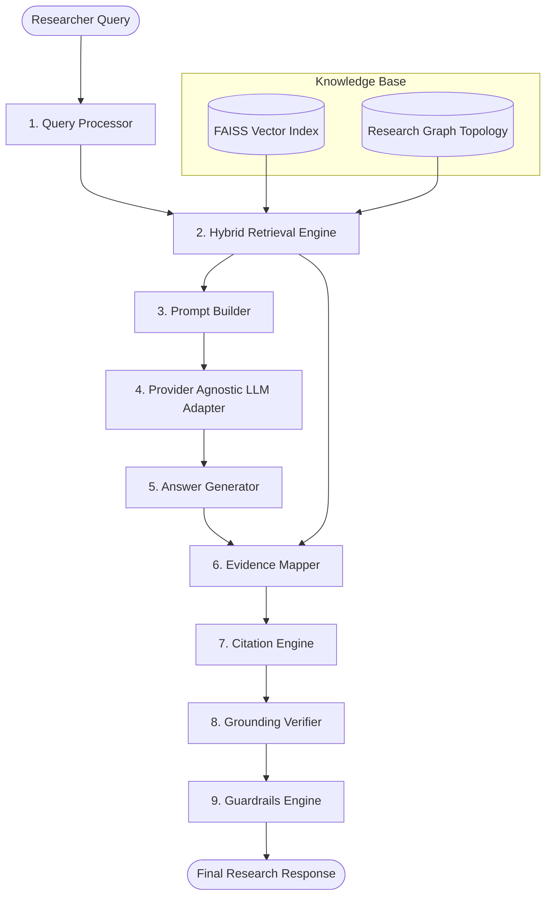

# RAG Pipeline Architecture - AI Research Assistant

## Overview

This document specifies the end-to-end architecture and component sequence of the **Retrieval-Augmented Generation (RAG)** pipeline in **MathResearch Studio**. The RAG pipeline combines Day 2 document parsing, Day 3 vector indexing, and Day 4 research knowledge graph topology to produce source-grounded mathematical answers with citations.

---

## Component Architecture Diagram

---

## Pipeline Execution Steps

1. **Query Processing (`src/rag/query_processing/`)**:
   - Normalizes whitespace, punctuation, LaTeX symbols, and theorem numbering.
   - Detects intent (`definition`, `theorem`, `lemma`, `proof`, `summary`, `dependency`, `notation`).
   - Extracts mathematical entities (*Definition 2.1*) and symbols ($\lambda$, $P_k$).

2. **Hybrid Retrieval Engine (`src/rag/retrieval/`)**:
   - Executes dense semantic search over FAISS vector index (`src/rag/vector_store.py`).
   - Reranks candidate chunks using weighted scoring abstraction (`WeightedScoringEngine`).

3. **Prompt Builder (`src/rag/prompt_builder/`)**:
   - Filters candidate chunks within token budget (`TokenManager`).
   - Formats context blocks and system instructions (`PromptFormatter`).

4. **LLM Adapter Layer (`src/rag/llm/`)**:
   - Provider-agnostic inference interface (`BaseLLMAdapter`, `MockLLMAdapter`, `LLMAdapterFactory`).

5. **Answer Generator (`src/rag/answer_generator/`)**:
   - Post-processes raw LLM text, validates syntax, and estimates confidence (`ConfidenceEstimator`).

6. **Evidence Mapping Layer (`src/rag/evidence/`)**:
   - Aligns generated answer sentences against retrieved evidence chunks (`AlignmentEngine`).
   - Computes context coverage ratio (`CoverageAnalyzer`).

7. **Citation Engine (`src/rag/citation_engine/`)**:
   - Formats inline citation markers (`[1]`, `(Author, 2024)`, `[Paper, Section, Page]`) (`CitationFormatter`).
   - Generates structured bibliographies (`CitationRenderer`).

8. **Grounding Verification Layer (`src/rag/grounding/`)**:
   - Extracts sentence claims and evaluates claim support levels (`SUPPORTED`, `PARTIAL`, `UNSUPPORTED`) (`ClaimVerifier`).

9. **Guardrails Layer (`src/rag/guardrails/`)**:
   - Enforces policy rules (`GuardrailRules`, `GuardrailDecisionEngine`).
   - Determines final decision (`RETURN`, `RETURN_WITH_WARNING`, `REFUSE`, `ASK_FOR_CLARIFICATION`, `INSUFFICIENT_EVIDENCE`).
