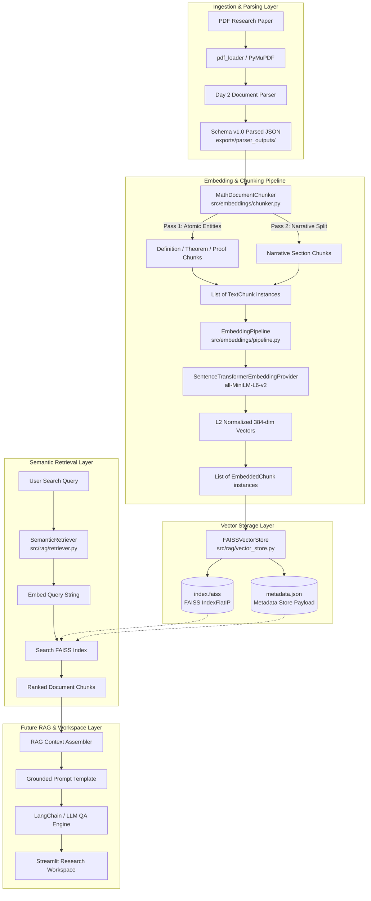

# Vector Database & Retrieval Architecture

## 1. Overview

This document describes the vector storage, embedding generation, and semantic retrieval architecture in **MathResearch Studio**. The vector database infrastructure connects raw PDF parser outputs to semantic search services and downstream Retrieval-Augmented Generation (RAG) capabilities.

---

## 2. Complete End-to-End System Architecture



---

## 3. Detailed Component Breakdown

### 1) Parser Output Integration
* **Input Schema**: Consumes `Schema v1.0` JSON outputs generated by the Day 2 document parsing pipeline (`exports/parser_outputs/paper_<id>.json`).
* **Attributes Retained**: `paper_id`, `title`, `authors`, `abstract`, `sections` (with headings, section types, and page ranges), and math statement entity dictionaries (`definitions`, `theorems`, `lemmas`, `corollaries`, `proofs`).

### 2) Section & Entity-Aware Chunking (`src/embeddings/chunker.py`)
* **Mathematical Entity Isolation**: Definitions, theorems, lemmas, corollaries, and proofs are extracted intact as single atomic chunks during Pass 1, preserving complete mathematical statements regardless of character length.
* **Narrative Section Splitting**: Pass 2 splits long narrative body text using paragraph (`\n\n`) and sentence boundaries (`. `), with a sliding character overlap (`chunk_overlap = 150`).
* **Data Model**: Produces `TextChunk` objects containing `chunk_id`, raw `text`, and `ChunkMetadata`.

### 3) Embedding Generation & Pipeline Orchestration (`src/embeddings/provider.py`, `pipeline.py`)
* **Abstract Provider Interface**: `EmbeddingProvider` decouples the system from specific model vendors (supporting seamless swapping between local Transformer models and external cloud APIs).
* **Default Model**: Uses `sentence-transformers/all-MiniLM-L6-v2`, mapping text strings to dense 384-dimensional floating-point vectors.
* **Batch Strategy**: `EmbeddingPipeline` processes chunks in batches (`batch_size = 32`) to optimize CPU/GPU matrix multiplication throughput and memory consumption.

### 4) FAISS Vector Indexing (`src/rag/vector_store.py`)
* **Index Type**: `faiss.IndexFlatIP` (Inner Product index over $L_2$-normalized vectors).
* **Metric**: Cosine Similarity ($u \cdot v$). Vector matrices are normalized using `faiss.normalize_L2()`.
* **Efficiency**: Offers fast CPU search latency (< 5ms for 1,000 vectors) without approximate clustering trade-offs.

### 5) Metadata Storage & Persistence
* **Disk Files**: Saved in `exports/vector_store/`:
  1. `index.faiss`: Binary serialized FAISS vector index file.
  2. `metadata.json`: JSON payload storing vector dimension, ordered `chunk_ids` array, and complete `ChunkMetadata` dictionaries.
* **Data Binding**: Position index $i$ in `index.faiss` maps strictly to index $i$ in `chunk_ids`, enabling immediate resolution of vector search results to original PDF pages, section titles, and author lists.

### 6) Semantic Retrieval (`src/rag/retriever.py`)
* **`SemanticRetriever` Class**: Converts natural language queries into embedding vectors, queries `FAISSVectorStore`, and formats top-$k$ results.
* **Result Payload**: Each retrieved chunk includes `chunk_id`, similarity `score`, chunk `text`, `paper_id`, `paper_title`, `authors`, `section_id`, `section_title`, `section_type`, `page_start`, `page_end`, and `entity_type`.

---

## 4. Vector Data Flow Sequence

```mermaid
sequenceDocument TD
    participant User as User / UI
    participant Ret as SemanticRetriever
    participant Prov as EmbeddingProvider
    participant Store as FAISSVectorStore
    participant FAISS as FAISS Index

    User->>Ret: retrieve("definition of compactness", top_k=5)
    Ret->>Prov: embed_text("definition of compactness")
    Prov-->>Ret: 384-dim Query Vector
    Ret->>Store: search(query_vector, top_k=5)
    Store->>Store: faiss.normalize_L2(query_vector)
    Store->>FAISS: index.search(query_matrix, top_k=5)
    FAISS-->>Store: scores[0], indices[0]
    Store->>Store: Map indices -> chunk_ids -> Metadata
    Store-->>Ret: list of raw search dicts
    Ret-->>User: list of formatted result dicts with text & provenance
```

---

## 5. Future RAG Integration Architecture

In subsequent milestones (Day 4+), the vector retrieval layer will plug directly into the RAG Question-Answering engine:

1. **Query Processing**: User submits a question in the Streamlit workspace.
2. **Context Retrieval**: `SemanticRetriever` fetches the top 5 most relevant mathematical statement chunks from the vector database.
3. **Source Grounding**: The RAG engine formats retrieved chunks into a strict system prompt template:
   > *"Answer the question using ONLY the provided mathematical paper context below. Include exact section titles and page numbers for every claim."*
4. **Grounded Answer Generation**: The LLM generates source-grounded answers with citations, ensuring responses never hallucinate beyond uploaded paper contents.
5. **Interactive Exploration**: Streamlit UI renders search results, mathematical LaTeX statements, and interactive theorem dependency graphs.
