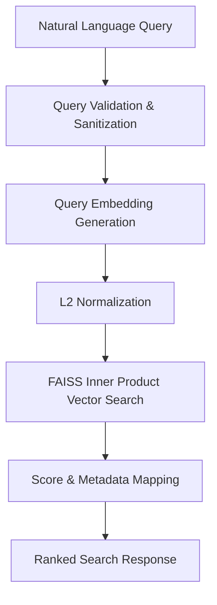

# Semantic Search API Specification

## 1. Input Specification

The Semantic Search interface accepts natural language queries from users or upstream services to retrieve relevant mathematical research paper chunks.

### Parameters

* `query` (`string`, required): Natural language search query or concept description (e.g., `"definition of compactness"`).
* `top_k` (`integer`, optional): Maximum number of search results to return. Must be a positive integer. Defaults to `5`.
* `filters` (`object`, optional): Optional metadata filtering parameters (e.g., filter by `paper_id` or `entity_type`).

---

## 2. Query Processing Pipeline

When a natural language query is received by `SemanticRetriever`, it passes through the following pipeline:



1. **Validation**: Confirms that the input query is a non-empty string and sanitizes surrounding whitespace.
2. **Embedding**: Passes the query string to the active `EmbeddingProvider`.
3. **Search**: Executes $k$-nearest neighbor search against `FAISSVectorStore`.
4. **Formatting**: Assembles and ranks search result payloads containing text, similarity score, and complete metadata.

---

## 3. Embedding Generation

The input query is converted into a 384-dimensional dense vector representation using the active embedding model (`sentence-transformers/all-MiniLM-L6-v2`):

* **Vector Normalization**: The resulting vector is $L_2$-normalized ($\|q\|_2 = 1$) to enable Cosine Similarity computation via Inner Product search.
* **Latency**: Typical CPU embedding generation latency for a search query is under 15ms.

---

## 4. Vector Search

The normalized query vector is passed to the FAISS vector index (`IndexFlatIP`):

* **Metric**: Cosine Similarity via Inner Product ($q \cdot v$).
* **Candidate Pool**: Searches across all indexed paper chunks in `exports/vector_store/index.faiss`.
* **K-Nearest Neighbors**: Retrieves the top $k$ vectors with highest inner product scores.

---

## 5. Result Ranking

Search results are ranked strictly by **Cosine Similarity Score** in descending order (highest similarity first):

* **Score Range**: Scores range from `-1.0` to `+1.0` (with `+1.0` indicating identical semantic direction).
* **Tie Breaking**: In the event of identical similarity scores, original document order is preserved.

---

## 6. Output Format

The search interface returns a list of result objects formatted as follows:

```json
[
  {
    "chunk_id": "string",
    "score": "float",
    "text": "string",
    "paper_id": "string",
    "paper_title": "string",
    "authors": ["string"],
    "section_id": "string",
    "section_title": "string",
    "section_type": "string",
    "page_start": "integer",
    "page_end": "integer",
    "entity_type": "string | null"
  }
]
```

---

## 7. Example Request

### Python API Call

```python
retriever = SemanticRetriever(provider=provider, vector_store=vector_store)
results = retriever.retrieve(query="main theorem", top_k=2)
```

### JSON Request Payload (FastAPI Endpoint)

```json
{
  "query": "definition of compactness",
  "top_k": 2
}
```

---

## 8. Example Response

```json
[
  {
    "chunk_id": "paper_6cd768c13674_definition_def_001",
    "score": 0.8412,
    "text": "Definition 2.1: A topological space X is compact if every open cover of X has a finite subcover.",
    "paper_id": "paper_6cd768c13674",
    "paper_title": "SCIBERT: A Pretrained Language Model for Scientific Text",
    "authors": [
      "Allen Institute for Artificial Intelligence"
    ],
    "section_id": "s2",
    "section_title": "2. Preliminaries",
    "section_type": "other",
    "page_start": 2,
    "page_end": 2,
    "entity_type": "definition"
  },
  {
    "chunk_id": "paper_6cd768c13674_s2_c003",
    "score": 0.6521,
    "text": "We review basic topological properties including sequential compactness and connectedness in metric spaces.",
    "paper_id": "paper_6cd768c13674",
    "paper_title": "SCIBERT: A Pretrained Language Model for Scientific Text",
    "authors": [
      "Allen Institute for Artificial Intelligence"
    ],
    "section_id": "s2",
    "section_title": "2. Preliminaries",
    "section_type": "other",
    "page_start": 2,
    "page_end": 3,
    "entity_type": "section_text"
  }
]
```

---

## 9. Error Handling

The retrieval interface includes robust validation and exception handling:

* **Empty Query**: Returns an empty result list (`[]`) and logs a warning if `query` is empty or whitespace-only.
* **Invalid `top_k`**: Raises a `ValueError` if `top_k <= 0`.
* **Empty Vector Index**: Returns `[]` gracefully with a log warning if searched before vectors are indexed.
* **Model Inference Failure**: Catches underlying PyTorch or Transformer failures and raises a structured `RuntimeError`.

---

## 10. Future API Improvements

* **Metadata Filtering**: Support filtering queries by `paper_id`, `section_type`, or `entity_type` (e.g., `retriever.retrieve(query="compactness", filters={"entity_type": "definition"})`).
* **Hybrid Search (Dense + Lexical)**: Combine FAISS dense vector search with BM25 keyword matching for exact symbol lookups.
* **Re-Ranking Layer**: Add a Cross-Encoder re-ranker model to re-score top-20 retrieved candidate chunks for higher precision.
* **FastAPI Endpoint Integration**: Expose `/api/v1/search` endpoint connecting Streamlit frontend to FastAPI backend.
